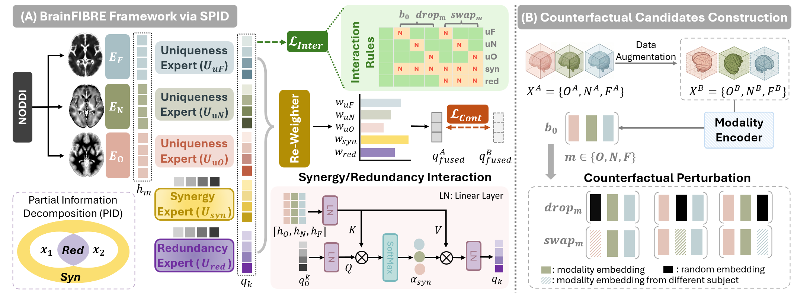

# BrainFIBRE

Official repository of the paper  
**BrainFIBRE: A Foundation Model via Information Decomposition for Brain Microstructure (*ECCV* 2026)**

[](https://arxiv.org/pdf/2607.00573)

## Overview



## 🏗️ Project Architecture

```
BrainFIBRE/
├── src/                            # Core source code
│   ├── models/                     # Model architecture and definitions
│   │   ├── vit_model.py            # Multi-modal ViT + experts
│   │   ├── pos_emb.py              # Positional encodings
│   │   └── masks.py                # Block masking and brain mask utilities
│   ├── attn_utils/                 # Attention utilities
│   │   ├── fa2_utils.py            
│   │   ├── expand_mask.py          
│   │   └── modeling_flash_attention_utils.py
│   └── utils/                      # General utilities
│       ├── misc.py
│       └── util.py
├── datasets/                       # Dataset and dataloader definitions
│   ├── dataloader_pretrain.py      # Self-supervised pretraining loader
│   ├── dataloader_internal.py      # Fine-tuning dataloader for internal corhot
│   ├── dataloader_external.py      # Fine-tuning dataloader for external corhot
│   └── util.py                     # NODDI file mapping

├── configs/                        # Configuration files
│   └── ukb_full_tuning.json        # Example fine-tuning config
├── scripts/                        # Training launch scripts
│   ├── run_pretrain.sh             # Pretraining launcher
│   └── run_finetune.sh             # Fine-tuning launcher
├── checkpoints/                    # Pretrained model weights
├── train.py                        # Self-supervised PID pretraining script
└── finetune.py                     # Downstream task fine-tuning script
```

## 🚀 Quick Start

### Environment Setup

```bash
# Create conda environment
conda create -n brainfibre python=3.10
conda activate brainfibre

# Install PyTorch (CUDA 12.4)
pip install torch==2.6.0 torchvision torchaudio --index-url https://download.pytorch.org/whl/cu124

# Install dependencies
pip install -r requirements.txt

pip install -e .
```

### Download Pretrained Checkpoints

<!-- Checkpoint download link will be added here -->

Place the downloaded checkpoints in:

- `checkpoints/` — BrainFIBRE pretrained model weights

### Training Pipeline

#### Stage 1: Self-supervised PID Pretraining

```bash
# Run pretraining with torchrun (multi-GPU)
bash scripts/run_pretrain.sh
```
*Note: Our pretraining was performed on 8 H200 (140G) GPUs.*

#### Stage 2: Downstream Task Finetuning

```bash
# Run fine-tuning on specified dataset and task (e.g., HCP-Aging age prediction, data split 1)
bash scripts/run_finetune.sh HCP age 1 full checkpoints/pretrain/ckpt_latest.pt hcp_finetune.json

# Usage: run_finetune.sh <dataset> <task> <splits> <tuning_mode> [pretrained_path] [params_json] [resume_path]
# Note: tuning_mode can be set to 'full' (fine-tune from pretrained) or 'tfs' (train from scratch)
```

## Citation

If you find this repository useful, please cite our *ECCV* 2026 paper:

```bibtex
@inproceedings{brainfibre2026,
  title={BrainFIBRE: A Foundation Model via Information Decomposition for Brain Microstructure},
  author={Dong, Zijian and Lin, Yi and Fang, Ji and Zhou, Jianxiong and Ng, Kwun Kei and Zhou, Juan Helen},
  booktitle={Proceedings of the European Conference on Computer Vision (ECCV)},
  year={2026}
}
```

---

*BrainFIBRE - First Brain Microstructure Foundation Model*
